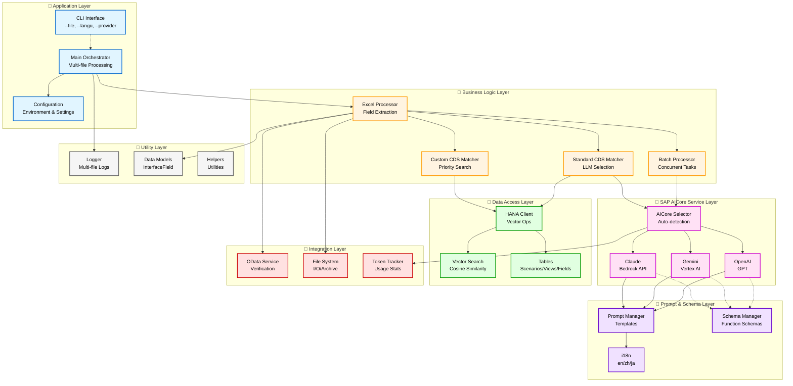
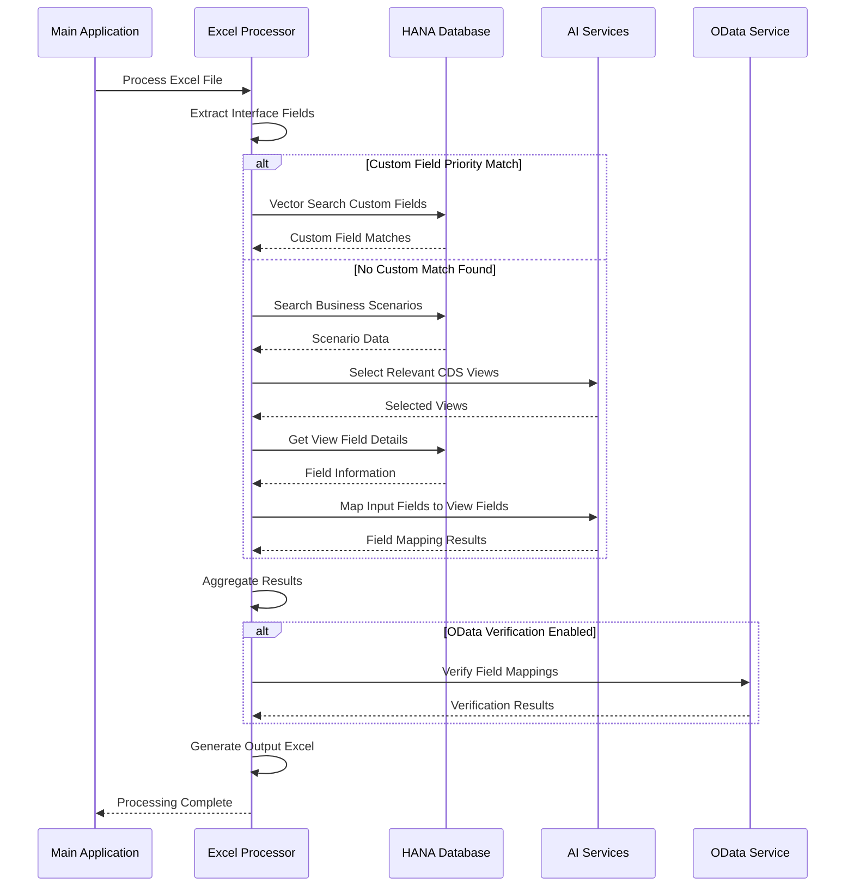

# SAP IF Design Generation Tool - Technical Architecture

## System Architecture Overview

## Component Interaction Flow

## Technology Stack

### Core Technologies
- **Language**: Python 3.12
- **Excel Processing**: openpyxl, pandas
- **Database**: SAP HANA Cloud
- **Vector Operations**: HANA VECTOR_EMBEDDING
- **AI Framework**: SAP AI Core Integration

### AI Services
- **Claude**: Anthropic Claude via SAP AI Core
- **Gemini**: Google Gemini via SAP AI Core
- **OpenAI**: GPT models via SAP AI Core

### Data Processing
- **Batch Processing**: ThreadPoolExecutor
- **Vector Search**: Cosine similarity with SAP NEB model
- **Multi-language**: Japanese, English, Chinese support

### Integration Points
- **SAP Systems**: OData services for verification
- **File System**: Excel input/output/archive management
- **Configuration**: Environment-based configuration
- **Logging**: Structured logging with file-specific tracking

## Key Architectural Patterns

### 1. **Pipeline Processing Pattern**
- Sequential stages of field processing
- Conditional routing based on match results
- Result aggregation and verification

### 2. **Service Layer Pattern**
- Abstracted AI service interfaces
- Provider-agnostic service selection
- Automatic fallback and resilience

### 3. **Repository Pattern**
- HANA database abstraction
- Vector search operations
- Data access object (DAO) pattern

### 4. **Strategy Pattern**
- Different column mapping strategies (SAP vs Standard)
- Configurable processing strategies
- Language-specific prompt management

### 5. **Observer Pattern**
- Token usage tracking
- Progress monitoring and logging
- Error handling and recovery

## Scalability Features

### Parallel Processing
- Multi-threaded batch processing
- Concurrent file processing
- Configurable concurrency limits

### Resource Management
- Connection pooling for HANA
- Memory-efficient Excel handling
- Token usage optimization

### Error Isolation
- Failed batch isolation
- Independent file processing
- Graceful degradation patterns